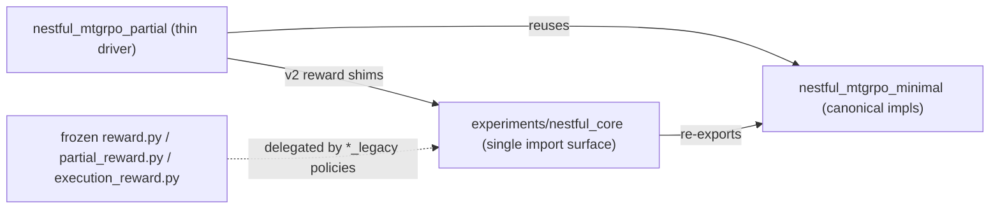

# Stabilized v2 pipeline — structure

This document describes the shared-core architecture introduced by the v2
stabilization work, how the minimal and partial experiments use it, and which
behaviours are new vs. preserved-for-reproducibility.

## Single source of truth: `experiments/nestful_core/`

`nestful_core` is the one import surface shared by both experiments. Most of its
modules are **thin re-export shims** over the proven, reproducible
implementations that live in `experiments/nestful_mtgrpo_minimal/` — there is
exactly one implementation, referenced from one place, so the two experiments
can no longer silently drift.

| core module | re-exports / provides | canonical source |
|---|---|---|
| `parser.py` | `parse_tool_call`, `parse_tool_calls_all`, `ParseResult`, **new** `parse_canonical` | `minimal/parser.py` |
| `executor.py` | `ToolExecutor`, `IBMFunctionRegistry`, `matches_gold`, … | `minimal/executor.py` |
| `rollout.py` | `Trajectory`, `Turn`, `run_episode`, `generate_once` | `minimal/rollout.py` |
| `prompt.py` | canonical helpers + **new** versioned `build_messages_v2` / `install_v2_prompt` | `minimal/prompt.py` |
| `scoring.py` | official-scorer wrapper (`build_item`, `score_items_per_sample`, …) | `minimal/nestful_official_score.py` |
| `data.py` | `load_tasks`, `load_tasks_mixed` + **new** `build_synthetic_splits` | `minimal/data.py` |
| `eval_loop.py` | `run_episode` + **new** `max_turns_for` (v2 turn budget) | `minimal/rollout.py` |
| `rewards.py` | **new** — predicates + legacy delegations + v2 rewards + registry | (this module) |
| `logging_utils.py` | **new** — CSV hygiene writer + reward-component logging | (this module) |

Importing `nestful_core` puts the minimal and partial experiment folders on
`sys.path` (`ensure_paths()`), so the canonical bare-name modules resolve from
any CWD.



## Reward policies (registry in `nestful_core/rewards.py`)

`get_episode_reward(policy)` / `get_episode_reward_seq(policy)` resolve by name:

| policy | status | notes |
|---|---|---|
| `strict_gold_trace` / `strict_gold_trace_legacy` | frozen | delegates to `reward.py` |
| `partial_gold_trace` / `partial_gold_trace_legacy` | frozen | delegates to `partial_reward.py` |
| `execution_aware` / `execution_aware_v1_legacy` | frozen | delegates to `execution_reward.py` |
| `partial_gold_trace_v2` | **new** | fixed edge cases, fixed baseline for comparison |
| `execution_aware_v2` | **new** | **primary** v2 training reward |

Legacy modules are never edited; all new behaviour is additive, so previously
reported numbers reproduce bit-for-bit.

### Explicit predicates (single source of truth)
`has_parse_error`, `has_no_tool_call`, `terminal_before_first_successful_tool`,
`num_successful_calls`, `has_invalid_reference`, `has_executor_error`,
`is_executable_trajectory`, `tool_final_answer_pass`, `tool_use_completeness`,
`gold_trace_progress`, `valid_references_fraction`, `too_few_calls`,
`num_extra_calls`.

### `execution_aware_v2` formula
```
R = 0.55·final + 0.20·executable + 0.10·completeness
  + 0.10·valid_refs + 0.05·gold_progress
```
Hard caps → 0: parse_error, clipped, no_tool_call, terminal_before_first_tool.
Soft caps: executor_error ≤ 0.25, invalid_reference ≤ 0.30, not_executable ≤ 0.25,
too_few_calls∧¬final ≤ 0.25, ¬final ≤ 0.35. Floor: executable∧final ≥ 0.85.
Extra calls: mild penalty only when the final answer is correct.

## How training selects a reward

`partial/run.py:_select_train_reward` maps `reward.train_policy` to a reward and
monkeypatches `grpo_train.episode_turn_reward_seq` in the parent. Data-parallel
rollout workers (separate processes) resolve the same policy independently via
`vllm_dp_pool._resolve_reward_fn`. Both paths now recognise `execution_aware_v2`
and `partial_gold_trace_v2` through the bare-importable shims
`partial/execution_reward_v2.py` and `partial/partial_reward_v2.py`, which
delegate to `nestful_core.rewards`.

## Prompt + parser + turn-budget unification (v2)

* Prompt: `SYSTEM_PROMPT_BASE + REACT_TOOL_FORMAT_RULES + REACT_STOP_RULES +
  {TRAIN_HARDENING | EVAL_HARDENING}` — train and eval share identical format and
  stop rules (`build_messages_v2`, opt-in via `install_v2_prompt`). Versions are
  recorded as `train_prompt_version` / `eval_prompt_version`.
* Parser: `parse_canonical(text)` exposes `strict_ok` / `lenient_ok` /
  `parse_recovery` so training (gate on strict, small recovery allowance) and
  eval (lenient + diagnostics) share one parser.
* Turns: `eval_loop.max_turns_for(task, train=…)` = `gold_n + 1` (cap `gold_n+4`)
  for BOTH train and eval, removing the legacy `max_turns_train = gold_n` bias.

## CSV hygiene

`nestful_core.logging_utils.write_csv` uses `csv.DictWriter` + `QUOTE_MINIMAL`,
forbids commas/newlines in header names, and serialises list/dict cells to JSON.
`tests/test_reports_loadable.py` asserts every `experiments/comparison/*.csv`
loads via `pandas.read_csv`.
