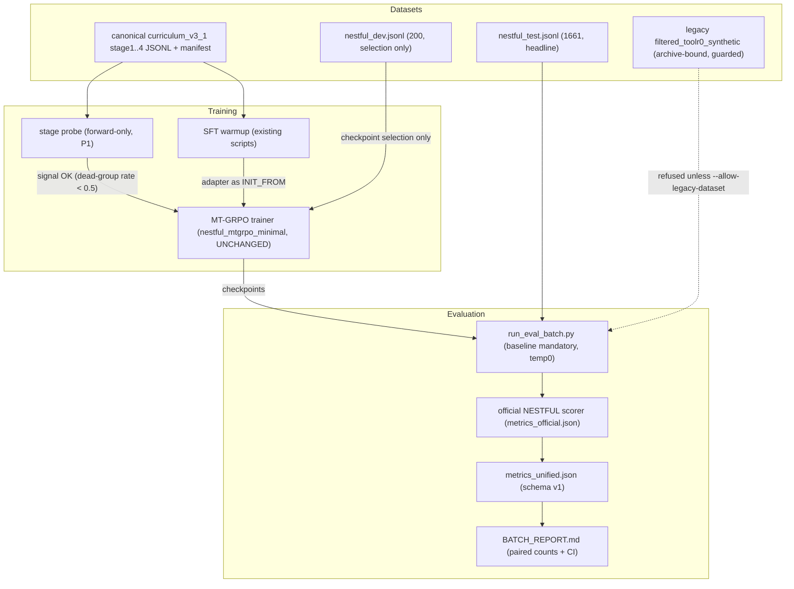

# TARGET ARCHITECTURE — nestful_synthetic_curriculum_v3

Date: 2026-07-09. Practical target; preserves the existing MT-GRPO trainer
(`experiments/nestful_mtgrpo_minimal/grpo_train.py` and friends) unchanged and wraps it with
safer, provenance-carrying entry points. Not everything below exists yet — see
`IMPLEMENTATION_ROADMAP_FROM_AUDIT.md` for which phase creates what.

## 1. Directory layout (target)

```
experiments/nestful_synthetic_curriculum_v3/
  README.md                      # entry point: what is canonical, how to run things
  configs/                       # reward yaml, (P1) extracted training/eval configs
  data/                          # (P3 move) canonical curriculum_v3_1 stage files + manifest
  docs/
    EVALUATION.md  DATASETS.md  TRAINING.md  REWARD.md  RUNBOOK.md
  lib/                           # importable reward modules (reward_v3_1 frozen;
                                 #   new policies as new files, e.g. reward_v3_2_dense)
  scripts/
    setup/    check_env.sh  install_deps.sh(P1)
    audit/    run_all_audits.sh          # re-runs audits/tools extractors
    eval/     eval_batch_temp0.sh  run_eval_batch.py
    probe/    probe_stage.sh  probe_stage.py            (P1)
    sft/      (existing SFT view/training/eval scripts stay)
    training/ run_grpo.sh  run_sft_plus_grpo.sh         (P1/P2)
    lib/      run_manifest.py  metrics_schema.py        # shared helpers (no GPU deps)
    pilot/    (existing pilot wrappers stay until archived)
  outputs/
    runs/<run_id>/               # training runs (gitignored heavy artifacts)
    evals/<batch_id>/            # NEW: all eval batches, flat, one level
    sft/...                      # SFT experiment outputs
  audits/                        # historical audit (frozen) + tools/
  archive/                       # (P3) legacy corpora, old runs, stale reports + README
```

Until the P3 move, canonical data stays at `outputs/curriculum_v3_1/filtered/` — all new
tooling resolves data through ONE constant in `scripts/lib/` so the later move is a one-line
change.

## 2. Data flow



Key invariants:

1. **Every eval result flows through the batch runner** — which guarantees: baseline cell in
   the same batch, temp0 (or explicitly recorded) decoding, official scorer output verified,
   run manifest written. Nothing else is allowed to produce comparison numbers.
2. **A stage is only trained after the probe says it has signal** (dead-group prediction
   < 0.5); Stage-1-style saturation is caught for the price of a forward pass.
3. **Reward policies are append-only modules** in `lib/` selected by config name; the audited
   `reward_v3_1.py` is never edited in place, so A/B against it stays possible.

## 3. Component contracts

### Datasets
- Canonical: `curriculum_v3_1/filtered/stage{1..4}_*.jsonl` + `curriculum_v3_1_manifest.json`.
  Identified by SHA256 (recorded in every manifest). Legacy corpora readable but guarded.
- New synthetic corpora (P2) must ship: generator script + seed, manifest with row counts and
  SHAs, zero-overlap proof vs NESTFUL dev/test (question hash, trace hash, sample id) using
  `audits/tools/dataset_audit.py`.

### Reward modules (`lib/`)
- Interface stays `episode_turn_reward_seq(trajectory, task, gold_observations) ->
  {r_seq, episode_reward, diagnostics}` with a `.reward_policy` attribute (what
  `grpo_train._verify_reward_dispatch` asserts).
- Diagnostics must include the band/cap reason and per-component scores (as v3_1 does).

### Evaluator (`scripts/eval/run_eval_batch.py`)
- Input: list of cells (`baseline` + checkpoints), dataset choice, decoding params.
- Wraps `nestful_mtgrpo_minimal/run.py --mode final_eval` per cell (subprocess, no trainer
  import), writes to `outputs/evals/<batch_id>/<cell>/` (flat — fixes the double-nesting and
  the report generator path bug).
- Post-conditions per cell: `metrics.json` (internal diagnostics), `metrics_official.json`
  (must exist or the batch fails), `metrics_unified.json`, `manifest.json`.
- Batch post-condition: `BATCH_REPORT.md` with official win per cell, binomial CI, paired
  gained/regressed vs baseline from per-sample official wins.

### Metric schema (`scripts/lib/metrics_schema.py`)
- `metrics_unified.json` v1: `schema_version`, `cell`, `checkpoint`, `dataset
  {name, path, sha256, n}`, `decoding {temperature, top_p, max_new_tokens, seed}`,
  `primary {official_nestful_win_rate}`, `official {full/partial acc, f1s}`,
  `diagnostics {internal_final_answer_win, final_answer_pass, solution_equivalent_pass,
  strict_gold_trace_pass, too_few_calls_rate, avg_predicted_calls, no_tool_call_rate,
  parse_error_rate}`, `paired_vs_baseline {gained, regressed, net}` (null for baseline).
- The word `win_rate` alone never appears as a key; internal is always
  `internal_final_answer_win`.

### Run manifest (`scripts/lib/run_manifest.py`)
- One JSON per run/batch: git commit + dirty flag, invoking command, config hash, dataset
  paths + SHA256s, seed, decoding, hostname, timestamp, tool versions (torch/vllm when
  importable). Eval runner writes it in P0; training launchers adopt it in P2.

### Training runner (P1/P2, `scripts/training/`)
- Thin wrappers over the existing `run_curriculum_v3.sh` / `run_curriculum.sh` chain:
  validate GPU topology and dataset paths up front, write manifest, forward to the unchanged
  pipeline. `run_sft_plus_grpo.sh` chains the existing SFT warmup output into
  `CHECKPOINT_IN`/`INIT_FROM=checkpoint`.

### Stage probe (P1, `scripts/probe/`)
- Loads a checkpoint (or base), rolls out `num_generations` completions on N tasks of a stage
  with the configured reward, reports: reward-band histogram, per-group unique episode
  rewards, predicted dead-group rate, too_few/wrong_tool rates. No optimizer, no adapter
  writes. Uses the same rollout + reward code paths as training for fidelity.

### W&B (P1)
- One project (`nestful-curriculum-v3_1`); training run name = run_id; eval batches logged as
  separate runs tagged with the checkpoints' run ids; `metrics_unified.json` uploaded as an
  artifact. Off by default when no `WANDB_API_KEY` (never blocks a run).

## 4. Output directory and archive policy

- `outputs/runs/<run_id>/` — training only. Heavy artifacts (safetensors, tokenizer files,
  trajectories, predictions, data_base copies) are **gitignored**; small JSON summaries,
  configs and gate reports are committed.
- `outputs/evals/<batch_id>/` — evaluation only, one level deep, batch id =
  `<name>_<UTCstamp>_temp<T>`; never nested inside a training run.
- `archive/` — anything superseded is `git mv`ed there with an entry in `archive/README.md`
  (old path → new path → reason). **Nothing is deleted.** Moves happen only in P3, after all
  launchers stop referencing old paths.
- Commit policy: no file > ~5 MB, no model weights, no per-sample dumps; enforced by
  `.gitignore` and documented in `docs/RUNBOOK.md`.
